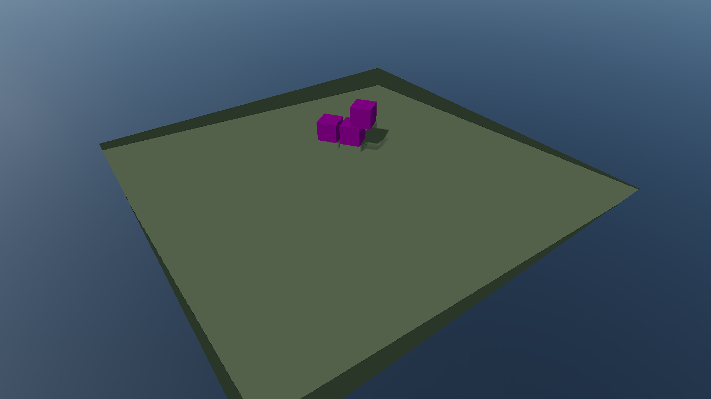
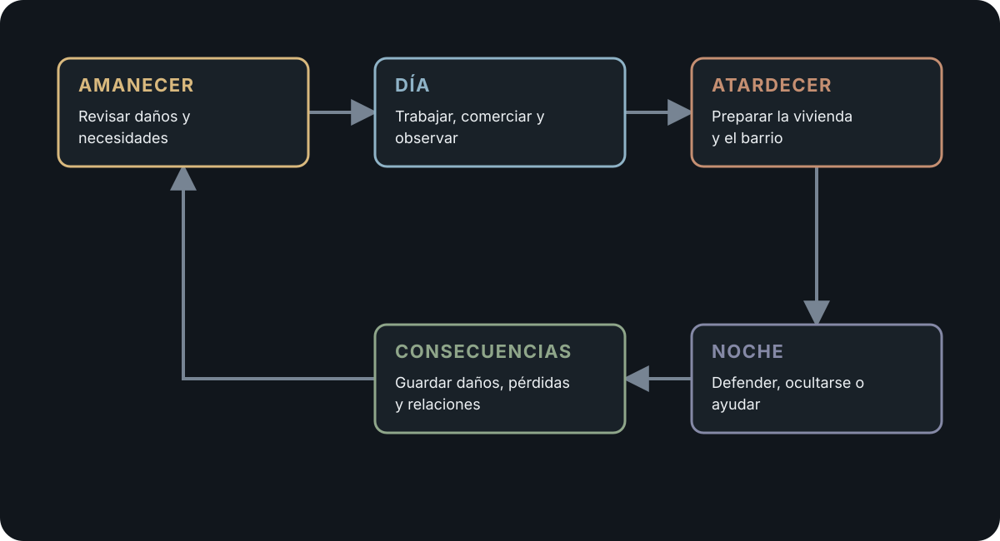

# Último Barrio

> De día mantienes el barrio vivo. De noche proteges tu casa.

Último Barrio nació de una idea bastante concreta: que tu casa dentro de un juego importe de verdad.

No queremos empezar prometiendo una ciudad enorme, cientos de jugadores o sistemas que todavía no existen. Primero queremos construir una sola manzana donde lo que hagas durante el día afecte a la noche, y donde los daños, el alijo y la relación con tus vecinos sigan ahí cuando vuelvas.

Cada jugador tendrá su apartamento y podrá protegerlo desde dentro, salir a defender la calle o ayudar a otro edificio. Cuando no haya más personas conectadas, los vecinos controlados por el juego mantendrán vivo el barrio.

Ahora mismo estamos en una pre-alpha real. El proyecto Empty de s&box ya existe, abre sin errores y estamos construyendo la primera escena jugable.

## Estado actual

- Proyecto real de s&box creado.
- Editor y runtime abiertos sin errores.
- Estructura open source preparada.
- Primera escena jugable en desarrollo.
- Todavía no existe una build pública.

  

  Estado real del proyecto durante el bootstrap. Todavía no representa gameplay.

## El bucle que queremos construir

El diseño se organiza alrededor de cinco momentos. Este diagrama describe el objetivo del juego; todavía no representa gameplay implementado.

  

## Por qué está abierto

Queremos que el repositorio también sirva como memoria del proyecto.

Si lo dejamos unas semanas, debemos poder volver y saber qué funcionaba, qué se había decidido y qué tocaba hacer después. Por eso documentamos desde el principio el estado, las pruebas, las decisiones y el origen de cada dependencia.

No es para aparentar que el proyecto es más grande. Es para evitar que termine convertido en una carpeta que nadie entiende.

## Qué queremos validar primero

El primer objetivo no es una ciudad completa. Es una manzana pequeña donde podamos probar una sesión de unos 18–22 minutos con:

- Un apartamento persistente por jugador.
- Un ciclo de amanecer, día, preparación, noche y consecuencias.
- Comercio legal y clandestino.
- Vecinos autónomos cuando faltan jugadores.
- Un asalto nocturno con objetivos físicos.
- Consecuencias persistentes sin borrar horas de progreso.
- Juego funcional en solitario y cooperativo para 1–4 jugadores.

La ambientación prevista es una ciudad mediterránea ficticia. Puede inspirarse en arquitectura y experiencias de resiliencia civil reales, pero las facciones y el conflicto serán inventados.

## Criterios de diseño

1. **La casa importa.** Las mejoras deben existir físicamente, no solo como números.
2. **El enemigo tiene objetivos.** Roba, registra, rompe, captura y se retira; no corre siempre hasta morir.
3. **Solo primero, cooperativo siempre.** Los vecinos controlados por el juego ocupan los huecos que no cubren jugadores.
4. **Consecuencias, no wipes.** Perder una noche cambia el barrio, pero no elimina la cuenta.
5. **Sistemas antes que contenido.** Pocas piezas que interactúan producen más historias que cien objetos aislados.
6. **Autoridad del host.** Dinero, daño, botín, guardado, IA y construcción se validan en servidor.
7. **Dependencias controladas.** Todo asset o librería queda registrado con autor, origen, versión y licencia.

## Abrir el proyecto

1. Instala s&box y su editor desde Steam.
2. Clona este repositorio.
3. Abre `ultimo_barrio.sbproj` desde la raíz del checkout.
4. Espera a que terminen de compilar los ensamblados del proyecto.
5. Consulta [`STATE.md`](STATE.md) antes de continuar: allí se registra el hito activo y la última validación conocida.

El proyecto Empty ya está incluido. No hace falta crear otro `.sbproj` ni copiar de nuevo el starter pack.

## Desarrollo técnico

El trabajo se divide en tareas pequeñas que deben dejar el editor compilando y la consola limpia. Cuando el editor está disponible, las herramientas MCP permiten inspeccionar la escena real, entrar en Play Mode y recoger evidencias sin deducir el estado únicamente desde los archivos.

Las instrucciones para Claude, Codex y otras herramientas de desarrollo están separadas de la identidad del juego:

- [`START_HERE.md`](START_HERE.md)
- [`STATE.md`](STATE.md)
- [`AGENTS.md`](AGENTS.md)
- [`CLAUDE.md`](CLAUDE.md)
- [`docs/GAME_DESIGN.md`](docs/GAME_DESIGN.md)
- [`docs/ARCHITECTURE.md`](docs/ARCHITECTURE.md)
- [`docs/ASSET_POLICY.md`](docs/ASSET_POLICY.md)

## Dependencias de armas

La estrategia inicial usa componentes oficiales para la lógica y la colección `facepunch/sboxweapons` como opción visual. OmniParadigm Weapons sigue siendo un candidato opcional, sujeto a comprobar fuente, licencia, autoridad de red, mantenimiento y dependencias. El núcleo del juego no debe depender de un paquete no verificado.

## Licencia y assets

El código original se publica bajo la [Mozilla Public License 2.0](LICENSE) (`SPDX-License-Identifier: MPL-2.0`).

Los assets de terceros conservan sus propias licencias y no quedan relicenciados por este repositorio. Consulta [`THIRD_PARTY_NOTICES.md`](THIRD_PARTY_NOTICES.md) y [`Assets/asset-registry.yml`](Assets/asset-registry.yml).

## Contribuir

Lee [`CONTRIBUTING.md`](CONTRIBUTING.md). Cada PR debe resolver una tarea concreta, explicar cómo probarla, mantener el proyecto compilando y registrar cualquier dependencia nueva.

No se acepta contenido extraído de juegos comerciales o de Garry's Mod sin permiso verificable.

## Nombre

`Último Barrio` es un nombre de trabajo. La arquitectura, documentación y organización no dependen del nombre comercial definitivo.
