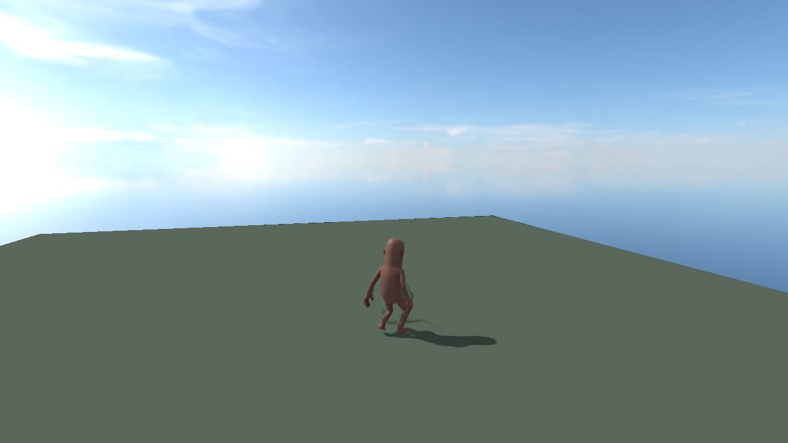

# M0-03 — Validación del primer boot

- Escena inicial: 2026-08-02
- Validación de input: 2026-08-03
- Rama: `feat/m0-bootstrap`
- Build de s&box: `26.07.22` (Steam BuildID `24338653`)

## Alcance de esta prueba

Esta prueba valida la escena principal, el arranque de Play Mode, la aparición
visual del jugador provisional, movimiento, salto y control de cámara. La
sesión con dos clientes pertenece a M0-04 y todavía no se ha ejecutado.

## Escena probada

`Assets/scenes/main.scene` contiene:

```text
World
├── PrototypeFloor
├── Sun
└── Sky
Systems
├── Main Camera
└── Player (prefab oficial Player Controller)
SpawnPoints
└── Primary Spawn
Debug
```

- `PrototypeFloor` usa `models/dev/plane.vmdl`, un material provisional y un collider plano estático.
- `Primary Spawn` usa el componente oficial `Sandbox.SpawnPoint`.
- `Player` instancia `templates/gameobject/player controller.prefab`.
- La escena incluye un `CameraComponent` principal y el controlador oficial está configurado para tercera persona.

## Resultado comprobado

| Comprobación | Resultado | Evidencia |
|---|---|---|
| `main.scene` guardada | PASS | El asset está compilado y no tiene cambios sin guardar. |
| Roots requeridos | PASS | `World`, `Systems`, `SpawnPoints` y `Debug` están serializados en la escena. |
| Compilación | PASS | 10 compiladores correctos; 0 errores y 0 avisos en runtime y editor del proyecto. |
| Inicio de Play Mode | PASS | El MCP informó `IsPlaying=true` sobre `main.scene`. |
| Jugador visible | PASS | Captura real `docs/media/first-boot.png`. |
| Render de cámara | PASS | La captura procede de la cámara de juego en tercera persona. |
| Movimiento y salto | PASS | El 2026-08-03 el operador comprobó WASD y `Espacio` con input real en el viewport. |
| Control de cámara | PASS | Se comprobó ratón y cambio entre tercera y primera persona. |
| Fin de Play Mode | PASS | El MCP informó `IsPlaying=false` al detener la prueba. |
| Excepciones | PASS | Tras la prueba no hubo entradas de nivel `Error` entre 53 entradas almacenadas ni avisos filtrados por `ultimo_barrio`. |
| Segundo cliente | NO EJECUTADO | No existe una herramienta MCP para lanzar, unir o controlar otra instancia. |

## Captura real



La imagen muestra el jugador provisional renderizado sobre el suelo de prueba.
No es concept art ni una captura de gameplay terminado. La captura por sí sola
no prueba movimiento; la evidencia de input es la observación manual registrada
el 2026-08-03 y la comprobación automatizada posterior de compilación, consola
y cierre de Play Mode.

## Repetir la prueba local

1. Abrir `ultimo_barrio.sbproj` en s&box.
2. Confirmar que `scenes/main.scene` está abierta y no tiene cambios sin guardar.
3. Esperar a que `local.ultimo_barrio` y `local.ultimo_barrio.editor` terminen de compilar.
4. Limpiar o anotar la consola y entrar en Play Mode.
5. Confirmar que el ciudadano provisional aparece sobre el plano y que la cámara en tercera persona renderiza.
6. Hacer clic en el viewport, usar WASD, pulsar `Espacio`, mover el ratón y
   alternar primera/tercera persona; observar desplazamiento, salto y cámara.
7. Salir de Play Mode y revisar la consola con filtro `Error`.
8. Ejecutar `scripts/check-m0-preflight.ps1` desde la raíz del repositorio.

## Resultado del hito

M0-03 está **COMPLETADO**. La siguiente prueba es M0-04:

- Ejecutar una sesión local con host y segundo cliente.
- Verificar ownership, movimiento independiente, cámara, desconexión y ambas
  consolas.
